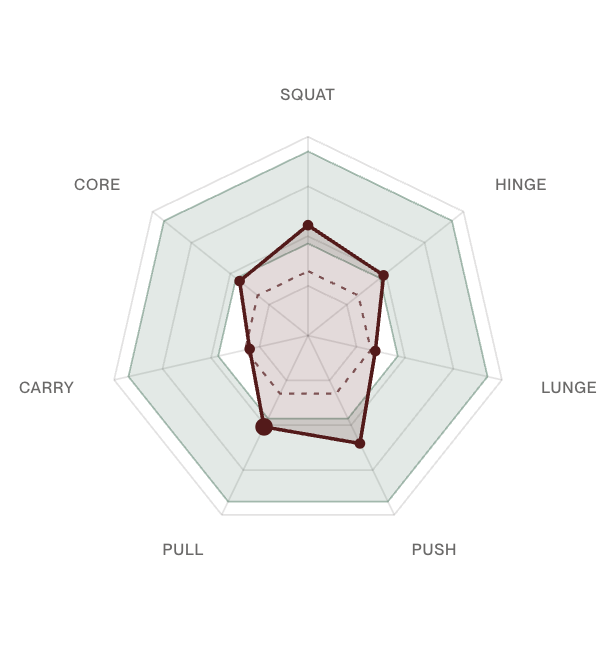

# Training Balance Map — a feature concept for Fort

A product case study: the feature I would build next if I were [Fort](https://www.fort.cx). Fort automatically detects and logs strength training; Training Balance Map turns that data into a simple answer to two questions:

> How has my recent training added up, and what might be useful to do next?

**Interactive demo:** ✨[fort-training-balance-map.vercel.app](https://fort-training-balance-map.vercel.app)✨


> This is an independent concept project. I'm not affiliated with Fort — all product decisions, models, and numbers here are my own exploration.

## Overview

The feature shows recent training across seven movement patterns:

- Squat
- Hinge
- Lunge
- Push
- Pull
- Carry
- Core

Each pattern moves toward, inside, or beyond a productive range as workouts accumulate and older training decays. The resulting shape gives users an at-a-glance view of what they have trained, what may be missing, and where they could focus next.



## User And Marketing Focus

Some users may train regularly; others may still be building a routine. In either case, they want more visibility into what balanced, productive training looks like, how their recent workouts are adding up, and what it might take to address gaps.

Other users already train consistently but still worry that they have not done enough. They may add sessions out of guilt, repeat work they have already covered, or struggle to recognize when recovery is the more productive choice. For them, the map offers reassurance: it makes completed work visible and helps them trust when their training is already on track.

Fort already removes the work of logging sets and reps. Training Balance Map extends that promise from automatic tracking to useful guidance:

> Fort does not just record your workouts. It shows how your training is adding up—so you can see when to do more and feel confident when you have already done enough.

## MVP

The first version would:

1. Map supported exercises to the seven movement patterns.
2. Convert completed sets into effective-set contributions for each relevant pattern.
3. Apply continuous time decay rather than resetting the map every Monday.
4. Compare the current values with research-informed productive ranges.
5. Suggest a possible training focus.

The MVP would focus on conventional resistance training whose movements can be mapped with reasonable confidence. I have left Pilates and other class-based workouts as an open question because I do not yet know how Fort tracks them or calculates load for these sessions (see Open Decisions And Next Steps).

## Non-Trivial Technical Details And Challenges

The prototype demonstrates the interaction using a back-of-the-envelope model. Its inputs and assumptions would need to be calibrated using Fort's internal research and data alongside established training research.

### Exercise-to-pattern deposits

Each physical set receives full credit toward its primary pattern and may also contribute to secondary patterns. These deposits are intentionally positive-sum: training one movement can load several areas. As a starting convention, the prototype uses `1.0`, `0.5`, and `0.25` for primary, secondary, and tertiary contributions.

```text
DEPOSIT PER WORKING SET

BARBELL ROW
├─ Pull    ████████  1.0
├─ Hinge   ████░░░░  0.5
└─ Core    ██░░░░░░  0.25

BACK SQUAT
├─ Squat   ████████  1.0
├─ Core    ████░░░░  0.5
└─ Hinge   ██░░░░░░  0.25

BENCH PRESS
└─ Push    ████████  1.0
```

The values represent deposits per working set, so three barbell-row sets would add 3 Pull sets, 1.5 Hinge sets, and 0.75 Core sets. For an MVP, Fort could begin with a manually reviewed seed taxonomy of 30 commonly detected exercises, then expand and recalibrate it using research, expert programming judgment, and observed Fort data. The prototype's coefficients are examples, not claims about exact physiological equivalence.

### Continuous decay

Each contribution would decay as time passes:

```text
current pattern value = sum(effective-set contribution × decay(days since workout))
```

This avoids an arbitrary weekly reset and makes the map responsive to the user's actual training rhythm. The prototype uses illustrative decay values. The curve, half-life, and minimum thresholds would need to be grounded in literature and calibrated against real training histories before the map could make strong recommendations.

### Hypertrophy and strength

Something I've gone back and forth on is whether the map should offer different goal “lenses”: Build Muscle (Hypertrophy), Get Stronger (Strength), and General Fitness. Counting hard sets can show how much training occurred, but it does not fully answer what adaptation that work supports.

A set can also support more than one goal. For example, a hard set of 10 back squats at zero reps in reserve would likely create a strong hypertrophy stimulus while still contributing to strength. A heavier, lower-rep set would shift that balance toward strength.

```text
BACK SQUAT × 3 SETS
10 reps · 185 lb · 0 RIR

185 lb ÷ 245 lb estimated 1RM = 76% relative load
                         │
                         ▼
ONE POSSIBLE POSITIVE-SUM MODEL

Hypertrophy  ██████████  1.0 / set × 3 = 3.0 effective sets
Strength     ███████░░░  0.7 / set × 3 = 2.1 effective sets
```

This leaves an unresolved accounting decision. A positive-sum model could deposit into both goals independently, as shown above. A zero-sum model might instead divide one set `67/33` between hypertrophy and strength. More thought and research would be needed before choosing between them because the decision changes the totals, ranges, and how a General Fitness view could combine the signals.

I left these lenses out of the prototype because estimating strength introduces a harder data requirement. Hypertrophy can begin with hard-set volume and proximity to failure; strength depends more heavily on the actual load used, its relationship to the user's capacity, and exercise specificity. Unless Fort captures the weight for each exercise or can infer relative load reliably, a strength lens would carry more error and risk presenting false precision.

For the MVP, one effective-sets view is the clearer starting point. A later version could determine whether goal selection changes the underlying values, changes only the productive ranges, or combines both signals into a General Fitness view.

## Open Decisions And Next Steps

Before moving beyond the concept, I would:

- Validate the initial exercise taxonomy, productive ranges, and decay assumptions using established training research and Fort data.
- Confirm the right level of movement-pattern abstraction. I used the seven patterns currently presented on [Fort's website](https://www.fort.cx/foundations) because they keep the map legible, but Push and Pull could be split into horizontal and vertical patterns if that added specificity produces more useful guidance.
- Decide how the map should behave when it has too little history or an exercise is detected incorrectly.
- Determine whether Pilates and classes belong on the same map or need a complementary layer.
- Revisit goal lenses after confirming whether Fort can capture or reliably infer load.
- Test whether the map provides reassurance or feels too technical for the Fort brand, including how much of the underlying calculation users should see.

A possible extension is to preview a planned or recommended workout as a second shape overlaid on the map, showing how it could change the user's balance before they begin.

## Demo

- Live: [fort-training-balance-map.vercel.app](https://fort-training-balance-map.vercel.app)
- Source: [`demo/index.html`](demo/index.html) — a single-file interactive prototype.
